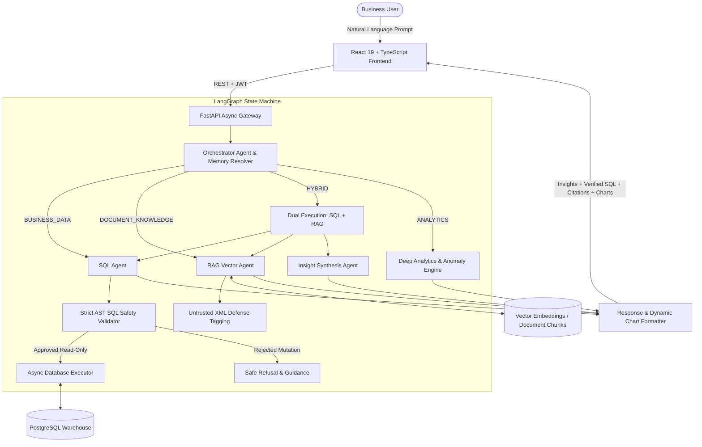

# AI-Powered Business Operations & Analytics Agent

A production-grade, enterprise-ready autonomous **Business Operations & Analytics Agent** platform. The system empowers executives, operations leaders, and analysts to query business performance, analyze transactional sales data, detect statistical anomalies, search company policy documents via RAG, and generate executive reports using natural language.

---

## Key Highlights & Capabilities

- **Multi-Agent Orchestrator (LangGraph)**: Dynamically routes questions across specialized agents:
  - **SQL Agent**: Text-to-SQL generation and safe read-only execution.
  - **RAG Agent**: Multi-format document parsing, semantic chunking, and tenant-isolated vector search with citations.
  - **Analytics Agent**: Customer LTV, churn risk detection, product gross margins, and expense efficiency.
  - **Anomaly Detection Service**: Explainable statistical anomaly detection using rolling moving averages and Z-scores with plain-English narratives.
  - **Insight Agent**: Synthesizes database facts and company strategy documents for **Hybrid questions** without fabricating causal claims.
  - **Executive Report Agent**: Generates multi-section business intelligence reports with one-click export to **PDF**, **CSV**, and **JSON**.
- **Strict Read-Only SQL Safety Guardrails**: AST regex validation rejecting mutating verbs (`DROP`, `DELETE`, `UPDATE`, `INSERT`, `ALTER`, `TRUNCATE`), multi-statement chaining (`;`), and comment stripping (`--`).
- **RAG Knowledge Base**: Upload and query enterprise documents (**PDF, DOCX, Markdown, TXT**) with page tracking, chunk previews, and exact source citations.
- **Prompt-Injection Defense**: Documents and untrusted content are wrapped in isolated `<untrusted_document_context>` XML tags to prevent policy overrides.
- **Multi-Turn Conversation Memory**: Retains short-term thread context (e.g. *"Show revenue for Q1"* $\rightarrow$ *"Compare it with Q2"*).
- **Dynamic Visualizations**: Integrated Recharts interactive dashboards and in-chat chart generation (Line, Bar, Pie, Donut charts) rendered directly beside analytical answers.
- **Docker Compose Ready**: One-command orchestrator for PostgreSQL database, async FastAPI gateway, and Vite frontend.

---

## System Architecture



---

## Complete User Journeys

### Flow 1: Financial & Sales Analytics
1. Sign in with the 1-click **Demo Account Credentials** (`admin@example.com` / `admin123`).
2. Ask: *"What was our total revenue last month?"*
3. The SQL Agent generates a verified read-only query, queries PostgreSQL, and presents the revenue total alongside an interactive monthly bar chart.

### Flow 2: Document Knowledge (RAG)
1. Navigate to **Knowledge Base** (`/documents`) and upload a policy PDF or click **"Seed Standard Policies"**.
2. Go to **AI Chat** and ask: *"What is our enterprise refund policy?"*
3. The RAG Agent performs semantic vector similarity search, extracts the relevant policy chunks, and answers with exact document citations (filename, section, and chunk).

### Flow 3: Hybrid Analysis (Database + Documents)
1. Ask: *"Why did revenue decline according to our sales strategy document?"*
2. The Orchestrator routes the question through both the **SQL Agent** (querying recent territory revenues) and the **RAG Agent** (retrieving the global sales strategy document).
3. The **Insight Agent** synthesizes a hybrid briefing explicitly delineating **Facts from Database**, **Strategy from Documents**, and **Derived Strategic Analysis**.

### Flow 4: Statistical Anomaly Detection
1. Ask: *"Detect any statistical anomalies in our recent revenue and expenses"*
2. The Anomaly Service computes rolling 6-month moving averages and Z-scores, outputting severity ratings (`CRITICAL`, `HIGH`, `MEDIUM`) with plain-English mathematical explanations.

### Flow 5: Executive Business Report & Export
1. Navigate to **Reports** (`/reports`) or ask: *"Generate the monthly business report"*.
2. Review the structured report (Executive Summary, Revenue Performance, Customer LTV, Product Margins, OpEx, Anomalies, Risks, and Recommendations).
3. Click **"Download PDF"** or **"Export CSV"** for immediate offline distribution.

---

## Tech Stack

### Backend
- **Python 3.11+ / 3.12**
- **FastAPI**: Async web framework with OpenAPI documentation
- **LangGraph & LangChain Core**: Stateful multi-agent reasoning, routing, and tool calling
- **SQLAlchemy 2.0 (Async) & asyncpg**: High-performance database ORM & connection pool
- **RAG & Vectors**: Semantic sliding-window chunker, dense embeddings, and cosine similarity ranking
- **Pydantic v2**: Structured output schemas (`AgentResponse`, `Citation`, `ChartSpec`, `ExecutiveReport`)
- **Pytest & pytest-asyncio**: Unit and integration test suite

### Frontend
- **React 19 & TypeScript**
- **Vite**: Ultra-fast bundler and development server
- **Tailwind CSS v4 & CSS Variables**: Custom dark glassmorphic design system
- **Recharts**: Responsive charting engine (Bar, Line, Pie, Donut)
- **TanStack React Query v5**: Server state caching, deduplication, and background updates
- **Lucide Icons**: Vector iconography

---

## Detailed Documentation

Comprehensive architectural and design documentation is available in [`docs/`](file:///c:/Users/Rushikesh/OneDrive/Desktop/AI-Powered%20Business%20Operations%20&%20Analytics%20Agent/docs/):
- [**System Architecture**](file:///c:/Users/Rushikesh/OneDrive/Desktop/AI-Powered%20Business%20Operations%20&%20Analytics%20Agent/docs/architecture.md)
- [**Multi-Agent Workflow & Routing**](file:///c:/Users/Rushikesh/OneDrive/Desktop/AI-Powered%20Business%20Operations%20&%20Analytics%20Agent/docs/agent-workflow.md)
- [**RAG Pipeline & Vector Search**](file:///c:/Users/Rushikesh/OneDrive/Desktop/AI-Powered%20Business%20Operations%20&%20Analytics%20Agent/docs/rag.md)
- [**Database Schema & Indexes**](file:///c:/Users/Rushikesh/OneDrive/Desktop/AI-Powered%20Business%20Operations%20&%20Analytics%20Agent/docs/database.md)
- [**Security & Guardrails**](file:///c:/Users/Rushikesh/OneDrive/Desktop/AI-Powered%20Business%20Operations%20&%20Analytics%20Agent/docs/security.md)
- [**AI Benchmark & Evaluation**](file:///c:/Users/Rushikesh/OneDrive/Desktop/AI-Powered%20Business%20Operations%20&%20Analytics%20Agent/docs/evaluation.md)

---

## Getting Started

### 1. Prerequisites
- **Node.js** (v18+)
- **Python** (v3.11+)
- **Docker** or **PostgreSQL**

### 2. Running with Docker Compose (Recommended)
```bash
docker compose up --build
```
- **Frontend App**: [http://localhost:3000](http://localhost:3000)
- **API Swagger Docs**: [http://localhost:8001/api/docs](http://localhost:8001/api/docs)
- **Health Check**: [http://localhost:8001/api/health](http://localhost:8001/api/health)

### 3. Running Locally

#### Backend Setup
```bash
# Activate virtual environment
.\.venv\Scripts\activate

# Install dependencies
pip install -r backend/requirements.txt

# Seed database with sample transactions and policy documents
python -m backend.app.db.seed

# Start FastAPI server
uvicorn backend.app.main:app --reload --port 8000
```

#### Frontend Setup
```bash
cd frontend
npm install
npm run dev
```

---

## Running Automated Tests & AI Evaluation

```bash
# 1. Run Backend Unit & Integration Tests
.\.venv\Scripts\pytest backend/tests -v

# 2. Run AI Quality Benchmark Evaluation
python eval/evaluate.py

# 3. Verify Frontend Production Build
cd frontend
npm run build
```

---

## Default Demo Credentials

For quick evaluation, use the one-click demo login button on the sign-in page:
- **Email**: `admin@example.com`
- **Password**: `admin123`
