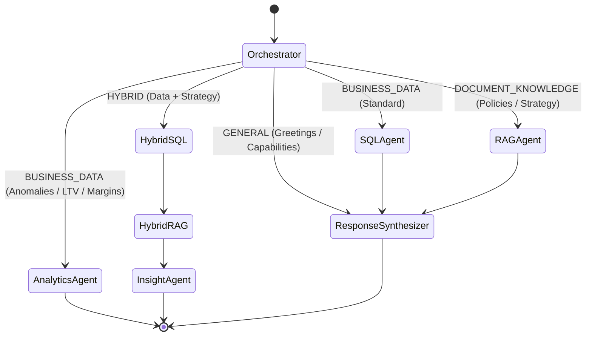

# Multi-Agent Workflow & Routing

## LangGraph State Machine

The orchestration graph governs state transitions across specialized agents. Every user query passes through the `Orchestrator` before dispatching to dedicated sub-agents.

---

## Routing Classification Matrix

| Intent Category | Typical Prompts | Executing Agent Nodes | Primary Outputs |
| :--- | :--- | :--- | :--- |
| **`BUSINESS_DATA`** | *"What was revenue last month?"*, *"Top 5 products by sales"*, *"Which region grew fastest?"* | `sql_agent` $\rightarrow$ `response_synthesizer` | Direct database answer, dynamic Recharts chart, query data table, verified SQL query. |
| **`DOCUMENT_KNOWLEDGE`** | *"What is our enterprise refund policy?"*, *"What are our support SLA targets?"* | `rag_agent` $\rightarrow$ `response_synthesizer` | Cited policy answer, document filename, page number, chunk excerpt. |
| **`HYBRID`** | *"Revenue declined in Europe, what does our sales strategy document say about this market?"* | `hybrid_sql_agent` $\rightarrow$ `hybrid_rag_agent` $\rightarrow$ `insight_agent` | Delineated Database Facts + Document Strategy + Actionable Synthesis. |
| **`ANALYTICS / ANOMALIES`**| *"Detect recent anomalies"*, *"What is our customer churn risk and LTV?"*, *"Product profit margins"* | `analytics_agent` | Statistical Z-score table, severity ratings, narrative explanation. |
| **`GENERAL`** | *"Hi"*, *"What can you do?"*, *"Who are you?"* | `response_synthesizer` | Natural conversation & system guidance. |

---

## Multi-Turn Context Resolution

The system retains recent conversation turns:
- **Turn 1**: *"Show our revenue for Q1."* $\rightarrow$ Agent executes SQL for Q1.
- **Turn 2**: *"Compare it with Q2."* $\rightarrow$ The `Orchestrator` retrieves previous context, recognizes the comparative follow-up, and generates a comparative SQL query across Q1 and Q2.
