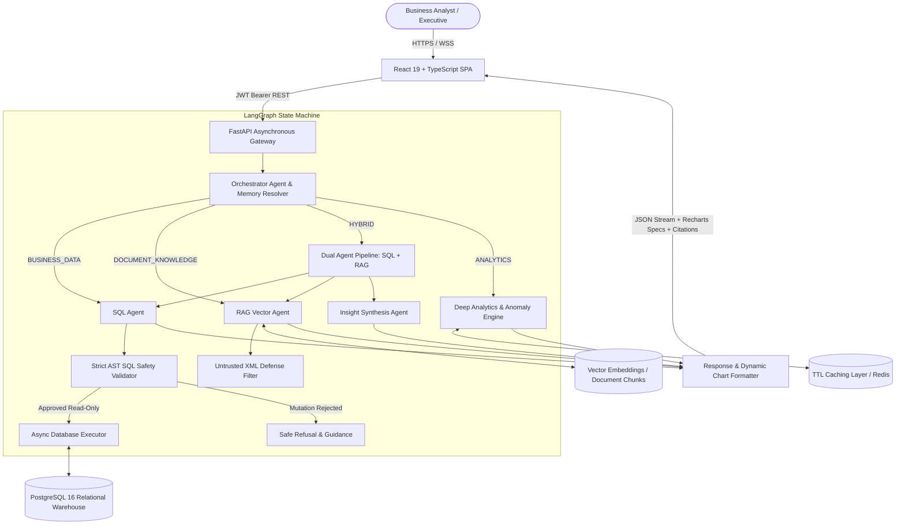

# System Architecture

## Overview

The **AI Business Operations & Analytics Agent** is an enterprise-grade platform uniting autonomous agentic reasoning with strict SQL safety guardrails, hybrid vector retrieval (RAG), and statistical anomaly detection.

---

## Component Responsibilities

| Component | Responsibility | Tech Stack |
| :--- | :--- | :--- |
| **Frontend** | Dark glassmorphic executive interface, AI command center, dynamic Recharts visualizations, document upload manager, and report exporter. | React 19, TypeScript, Vite, Recharts, Tailwind CSS v4, Lucide |
| **Gateway** | Asynchronous ASGI request routing, JWT validation, rate limiting, request tracing, and error handling. | FastAPI, Pydantic v2, Python-Jose |
| **Orchestrator Agent** | Intent classification (`BUSINESS_DATA`, `DOCUMENT_KNOWLEDGE`, `HYBRID`, `GENERAL`) and multi-turn conversational context resolution. | LangGraph, LangChain Core |
| **SQL Agent** | Schema context retrieval, Text-to-SQL generation, AST regex query validation, and bounded execution. | SQLAlchemy 2.0 Async, asyncpg |
| **RAG Agent** | Multi-format document parsing (PDF, DOCX, TXT, MD), semantic text chunking, dense vector similarity, and citation extraction. | Custom Embedding Vectorizer, Cosine Scoring |
| **Analytics Engine** | Customer Lifetime Value (LTV), repeat purchase velocity, gross product margins, expense ratios, and Month-over-Month growth. | SQLAlchemy Core |
| **Anomaly Service** | Rolling moving averages, variance bounds, and Z-score calculations with explainable plain-English narratives. | Statistical Analytics Module |
| **Report Agent** | Multi-dimensional executive report generation with export streaming (PDF, CSV, JSON). | Python CSV, ReportLab |
