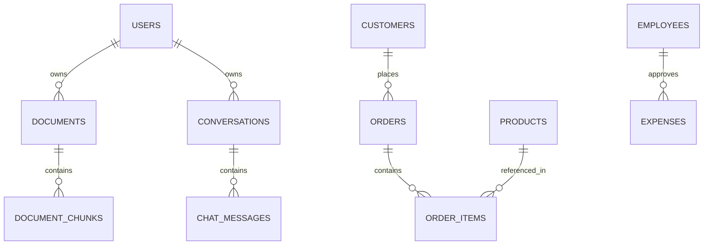

# Database Schema & Performance Indexing

## Entity-Relationship Overview

---

## Schema & Tables

### 1. Business Operational Tables
- **`customers`**: Client profiles, contact, regional territory, segment (`enterprise`, `smb`, `regular`).
- **`products`**: Product catalog, SKU, category (`Software`, `Platform`, `Security`, `Automation`), `unit_price`, `unit_cost`.
- **`orders`**: Transaction records, `customer_id`, `order_date`, `status` (`completed`, `processing`), `total_amount`, `region`.
- **`order_items`**: Order line items, `product_id`, `quantity`, `unit_price`, `total_price`.
- **`expenses`**: Operating expenses, `category` (`Payroll`, `Infrastructure`, `Marketing`, `Facilities`), `amount`, `expense_date`, `department`.
- **`employees`**: Internal headcount, department, role, salary, hire date.
- **`support_tickets`**: Customer tickets, priority (`P1` to `P4`), status, resolution times.

### 2. RAG & Conversation Tables
- **`documents`**: Uploaded file metadata, `user_id`, `filename`, `file_type`, `file_size`, `chunk_count`, `status`.
- **`document_chunks`**: Segment text, `document_id`, `user_id`, `chunk_index`, `page_number`, `embedding` vector.
- **`conversations`**: Multi-turn chat session threads, `user_id`, `title`, timestamps.
- **`chat_messages`**: Individual messages, `role`, `content`, `intent`, `chart_data`, `table_data`, `citations`, `metadata_json`.

---

## Performance Indexes

The schema implements compound and targeted B-tree indexes for fast queries:
- `ix_orders_date_region`: `(order_date, region)` — fast temporal and geographic filtering.
- `ix_orders_status`: `(status)` — rapid exclusion of non-completed orders.
- `ix_customers_region_segment`: `(region, segment)` — demographic grouping.
- `ix_expenses_category_date`: `(category, expense_date)` — monthly OpEx aggregation.
- `ix_chunks_user_doc`: `(user_id, document_id)` — tenant-isolated chunk retrieval.
- `ix_messages_conv_created`: `(conversation_id, created_at)` — thread message history retrieval.
