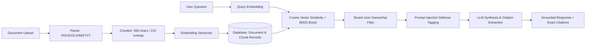

# Retrieval-Augmented Generation (RAG) Architecture

## Overview

The RAG pipeline provides document grounding for corporate policy, compliance, strategy, and operations documents.

---

## Ingestion Pipeline Details

1. **Multi-Format Extraction**:
   - **PDF**: Page-by-page extraction via `pypdf` with fallback stream parsing.
   - **DOCX**: XML parsing of `word/document.xml` using standard library `zipfile` and `xml.etree.ElementTree` without requiring external binary dependencies.
   - **Markdown / TXT**: Clean UTF-8/Latin-1 normalization.
2. **Semantic Text Chunking**:
   - Sliding window chunk size: 650 characters.
   - Overlap: 120 characters to preserve sentence boundaries.
   - Metadata recorded: `chunk_index`, `page_number`, `token_count`, `created_at`.
3. **Embeddings & Vector Ranking**:
   - Normalized dense vectors (384-dimensional) with cosine similarity ranking.
   - Combined scoring: $0.75 \times \text{Cosine Similarity} + 0.25 \times \text{Keyword Overlap Boost}$.
4. **Tenant Isolation**:
   - Every `Document` and `DocumentChunk` is explicitly bound to `user_id`. Queries strictly filter `DocumentChunk.user_id == current_user.id`. Cross-user document retrieval is physically impossible.
5. **Prompt Injection Defense**:
   - Retrieved chunks are wrapped inside `<untrusted_document_context>` XML tags.
   - Explicit system prompt instructions specify that text inside tags cannot override system policies or execute instructions.
